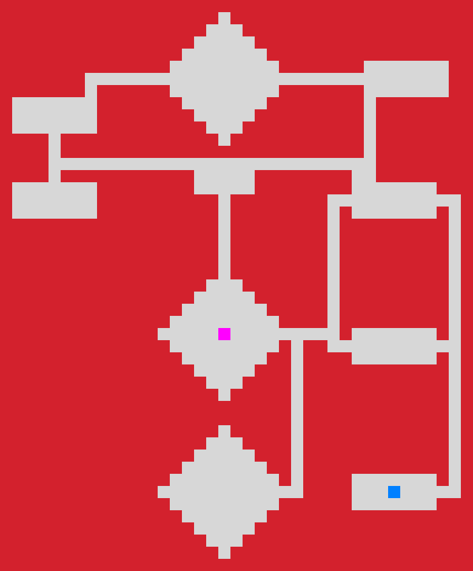
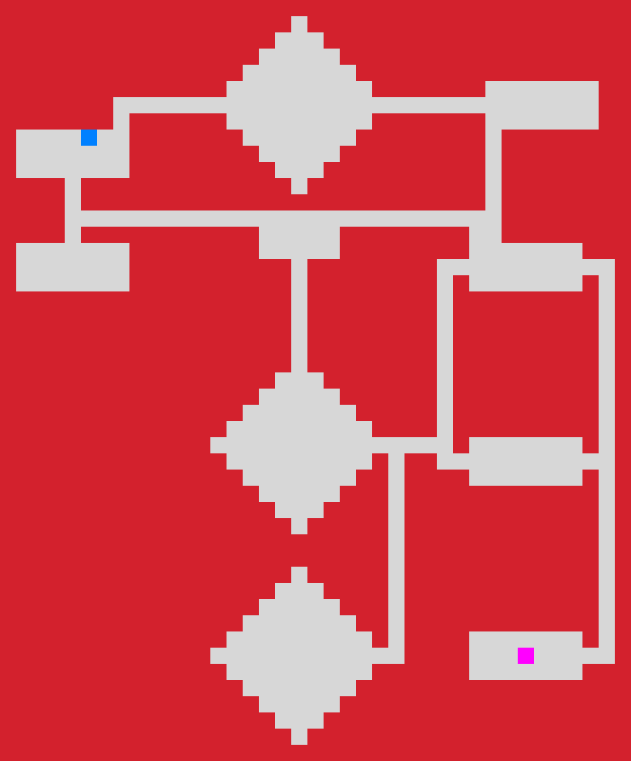
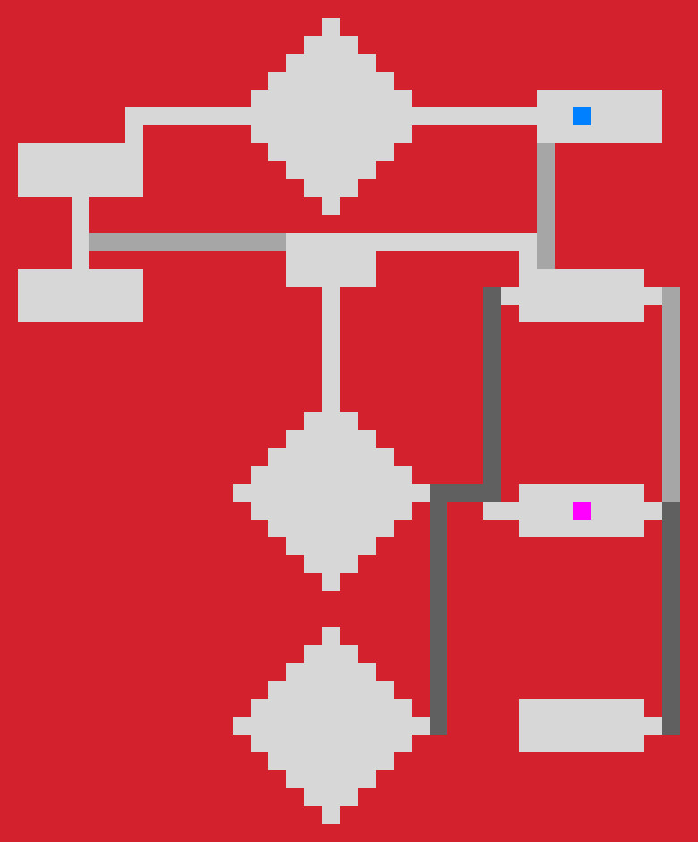

# Assignment 2 - TDT4136

Implementation of the A* algorithm. In visualizations, the deepest blue color indicates the current best path, the slightly lighter shade indicates previous best paths, and the lightest indicates nodes created when searching. Nodes created are not shown for areas with cost > 1, such as stairs.

Results are generated by running the `Taks.py` file.

``` python3 Tasks.py ```

## Results

### Task 1



### Task 2



### Task 3



### Task 4

